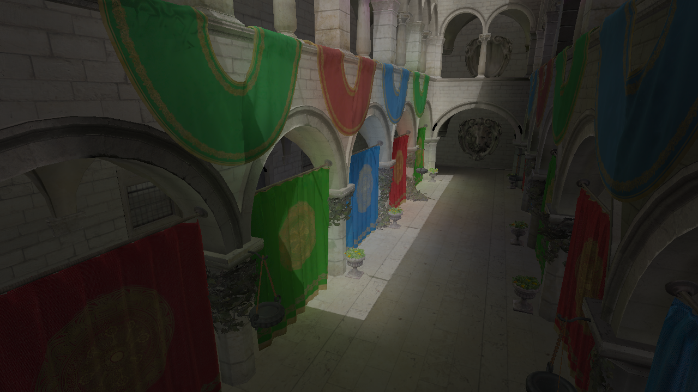
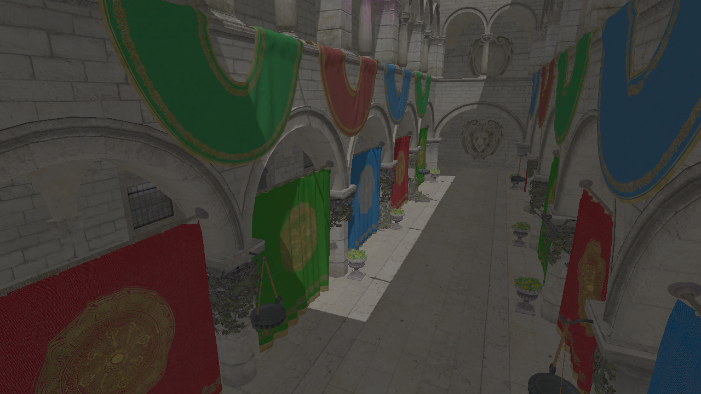
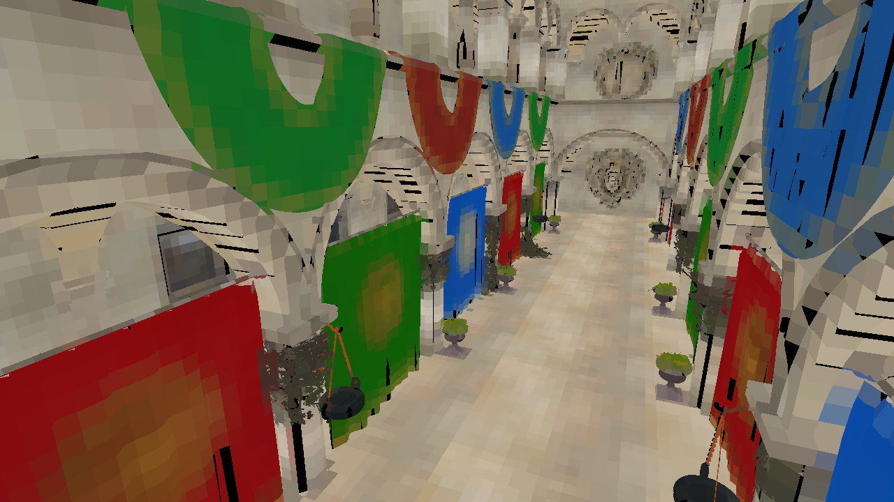
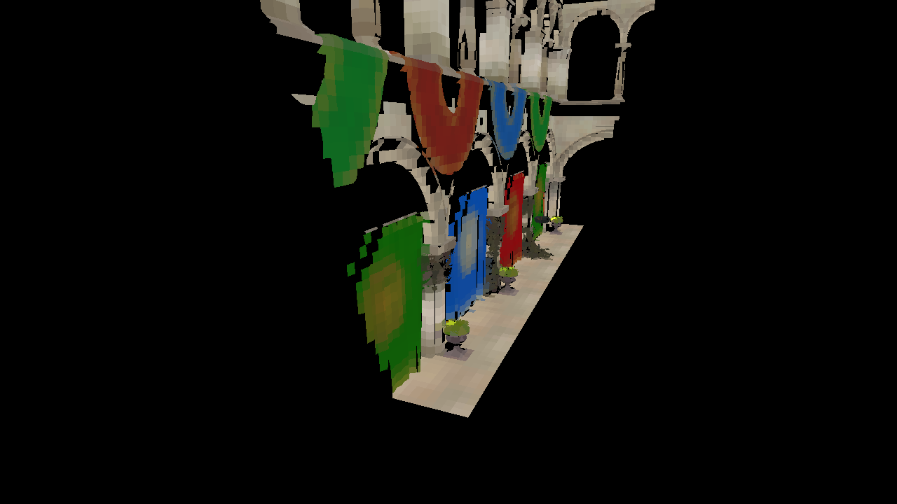

# Voxel Cone Tracing
This is the implementation for my passing thesis, Real-Time Dynamic Global Illumination using Warped Voxel Cone Tracing.

At its core, the application is a standard forward rendering engine supporting multiple lights, shadow mapping, and normal mapping---in addition, of course, to full real-time dynamic global illumination. The scene to be rendered is composed of one or more actors, which are simply meshes loaded from the generic Wavefront OBJ file format. Actors are also capable of rigid body animations.

In general, the main steps in the rendering pipeline are generating a voxelized representation of the scene, creating a filtered representation of light from the voxels and light sources, and finally shading the scene.

Screenshots are included at the bottom of the README.

## References
* [Interactive Indirect Illumination Using Voxel Cone Tracing](https://research.nvidia.com/publication/interactive-indirect-illumination-using-voxel-cone-tracing)
* [OpenGL Insights: Octree-Based Sparse Voxelization Using the GPU Hardware Rasterizer](https://www.seas.upenn.edu/~pcozzi/OpenGLInsights/OpenGLInsights-SparseVoxelization.pdf)

## Libraries Used
* [glad](https://github.com/Dav1dde/glad)
* [GLFW](http://www.glfw.org/)
* [GLM](https://glm.g-truc.net/0.9.8/index.html)
* [stb_image.h](https://github.com/nothings/stb)
* [tiny_obj_loader.h](https://github.com/syoyo/tinyobjloader)
* [nuklear](https://github.com/vurtun/nuklear)

## Models
* [PBR Sponza](www.alexandre-pestana.com/pbr-textures-sponza/)

## Building
### Linux
1. Install glm and glfw3 using your package manager.
2. `cd` into root directory of project. `mkdir build; cd build; cmake ..; make`.
3. Good to go!

### Windows
1. Install Visual Studio Community 2017. Make sure to install Visual C++ and enable the "Desktop development with C++" option.
2. Install dependencies using [vcpkg](https://github.com/Microsoft/vcpkg).
    * Clone or download vcpkg to `C:\src\vcpkg`.
    * Install vcpkg, integrate with Visual Studio, and install packages:
    ```
    C:\src\vcpkg> .\bootstrap-vcpkg.bat
    C:\src\vcpkg> .\vcpkg.exe integrate install
    C:\src\vcpkg> .\vcpkg.exe install glm glfw3
    ```
    You can also install x64 versions of the libraries:
    ```
    C:\src\vcpkg> .\vcpkg.exe install glm:x64-windows glfw3:x64-windows
    ```
3. If you didn't install vcpkg to `C:\src\vcpkg`, update the `CMAKE_TOOLCHAIN_FILE` variable in `CMakeSettings.json` appropriately.
4. In Visual Studio, open the project by going to `File>Open>CMake...` and selecting the `CMakeLists.txt` file in the root project directory.
5. Good to go!

## Screenshots
With global illumination: 

Without global illumination: 

Voxelized representation of the scene (cracks are from not using perfect conservative rasterization, which is okay for our purposes): 

The voxelized VPLs (virtual point lights) that are filtered and cone traced (to approximate indirect lighting): 
